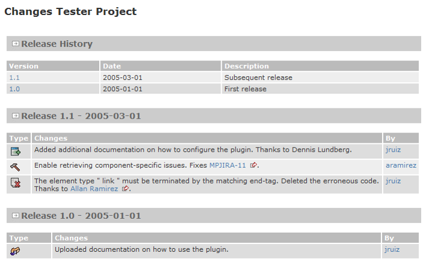

<!-- .slide: data-background="img/background_title.jpg" data-state="intro" class="center" -->
 <!-- .element: class="cc_logo" -->
## Scrum for developers - Sprint 2 <!-- .element: class="heading" -->
----
### Release Management <!-- .element: class="heading" -->

---

### Agenda
* Dealing with unfinished features
* Version Numbers
* Release Artifacts
* Release Notes
* Database Migration

---

### What is part of a release ?
* Meaningful version number
* Release notes that communicate what's new in each
* Installation and migration instructions
* All features of a release are finished and tested

---

### Dealing with unfinished features

**The end user does not want to see work-in-progress in a release version!**
<!-- .element: style="font-size: 0.7em" -->

| Feature Branches                                        | Master Based Development                                       |
|---------------------------------------------------------|----------------------------------------------------------------|
| Only done stories in **master** branch                  | Feature Toggles to hide unfinished features from end user      |
| Inhibits refactoring (big, daring merge coming ahead!)  | Every commit is automatically integrated                       |
| Continuous integration is hard to set up                | Database migration is a difficult                              |
<!-- .element: style="font-size: 0.7em" -->

---

### Dealing with unfinished features

<div class="dodbox">
**Definition of Done**
* stories are developed in (feature) branches

---

### Semantic versioning

Given a version number **MAJOR.MINOR.PATCH**, increment the:
<!-- .element: style="font-size: 0.8em" -->

* **MAJOR** version when you make incompatible API changes,
* **MINOR** version when you add functionality in a backwards-compatible manner, and
* **PATCH** version when you make backwards-compatible bug fixes.

See http://semver.org/

---

### ScrumForDevelopers Versioning

| Version Component | Meaning |
|-------------------|---------|
| Major             | Incremented with every major release. Not used in training. <br/> Starts at 1. |
| Minor             | Every sprint has its own number. <br/> Starts at 1. |
| Patch             | Increases with every bugfix release. <br/>Starts at 0. |
<!-- .element: style="font-size: 0.7em" -->

**SNAPSHOT versions are only for development.<br/>Releases with SNAPSHOT-versions are not allowed**
<!-- .element: style="font-size: 0.7em" -->

---

### Version numbers with maven
<!-- .slide: style="font-size: 0.7em" -->

**Steps for a new release (at the end of each sprint)**

1. Set version in all pom.xml files to the next release number <br/>(e.g. from 1.4.0-SNAPSHOT to 1.4.0)
2. Build project locally (to check if everything is working)
3. Commit and push (make sure you are on the master branch)
4. Create tag (and push it)
5. Let Jenkins build and deploy release artifacts


**To restart work on a new release (at the start of the new Sprint)**
1. Set version in all pom.xml files to the next SNAPSHOT number </br>(e.g. from 1.4.0 to 1.5.0-SNAPSHOT)
2. Commit and push
3. Merge changes into all open feature branches

---

### Version numbers

<div class="dodbox">
**Definition of Done**
* version number is incremented
* stories are developed in (feature) branches <!-- .element: class="former" -->

---

### Release artifacts

**Binary artifacts for every release are stored in a artifact repository (Artifactory)**

* Allows going back to previous versions quickly
* Deploy same binaries to multiple environments
* Depend only on binaries, not on code (because every build can produce slightly different binaries - even with the same code)

---

### Release artifacts

<div class="dodbox">
**Definition of Done**
* release artifacts are deployed in artifactory
* version number is incremented <!-- .element: class="former" -->
* stories are developed in (feature) branches <!-- .element: class="former" -->

---

### Release notes
<!-- .slide: style="font-size: 0.8em" -->

* **Maven Changes Plugin** generates release note reports
* Integrates into to the project site
* Extracts changes from changes.xml file in the project sources
* Can also extract changes from issue tracker (like github)

<br/>

| Maven Goal | Description |
|------------|-------------|
| changes:changes&#8209;report | Create a report with changes between different releases of the project |
| changes:github&#8209;report | Create a report from the issues from GitHub |

---

### Release notes - changes.xml

```xml
<document>
  <properties>
    <title>Changes for Worblehat Webapp</title>
    <author email="markus.bonsch@codecentric.de">Markus Bonsch</author>
  </properties>
  <body>
    <release version="0.8" date="2011-04-05" description="First release">
      <action dev="betaworblers" type="update">
        Adding new books.
      </action>
    </release>
    <release version="0.9" date="2011-04-06"
        description="Second Release with much improved functionality">
      <action dev="betaworblers" type="update">
        Borrowing books.
      </action>
    </release>
</document>
```

---

### Release notes - example


---

### Release notes

<div class="dodbox">
**Definition of Done**
* release notes are updated
* release artifacts are deployed in artifactory <!-- .element: class="former" -->
* version number is incremented <!-- .element: class="former" -->
* stories are developed in (feature) branches <!-- .element: class="former" -->

---

### Database migration with liquibase

*Liquibase is an open source (Apache 2.0 Licensed), database-independent library for tracking, managing and applying database changes.*

* Changesets version controlled and a part of the sources
* Liquibase executes changesets in correct order
* Liquibase "remembers" which changes were already applied
* Modification of already applied changes is not allowed

---

### Liquibase maven integration

| Maven Goal | Description |
|------------|-------------|
| liquibase:update | Update the database to the latest version |
| liquibase:updateSql | Generate SQL for updating to the latest version
| liquibase:tag | Create a tag in the database for rolling back later
| liquibase:rollback | rollback changesets (last, to date, to tag)
| liquibase:status | Display status of target database
| liquibase:diff | Diff two databases or database to hibernate config|
| liquibase:help | Description of all Maven goals |
<!-- .element: style="font-size: 0.7em" -->

---

### Liquibase example

```xml
<?xml version="1.0" encoding="UTF-8"?>
<databaseChangeLog >
        <include file="de/codecentric/psd/worblehat/liquibase-changesets/version-1.0/001-initialize-db.sql" />
</databaseChangeLog>
```

```sql
-- liquibase formatted sql

-- changeset action:create_table_books
CREATE TABLE book (
  id BIGINT PRIMARY KEY NOT NULL AUTO_INCREMENT,
  title VARCHAR(255),
  author VARCHAR(255),
  edition VARCHAR(255),
  isbn VARCHAR(255),
  year_of_publication INT,
  UNIQUE (isbn)
);
```

---

<div class="dodbox">
**Definition of Done**
* automated database migration works
* release notes are updated <!-- .element: class="former" -->
* release artifacts are deployed in artifactory <!-- .element: class="former" -->
* version number is incremented <!-- .element: class="former" -->
* stories are developed in (feature) branches <!-- .element: class="former" -->
